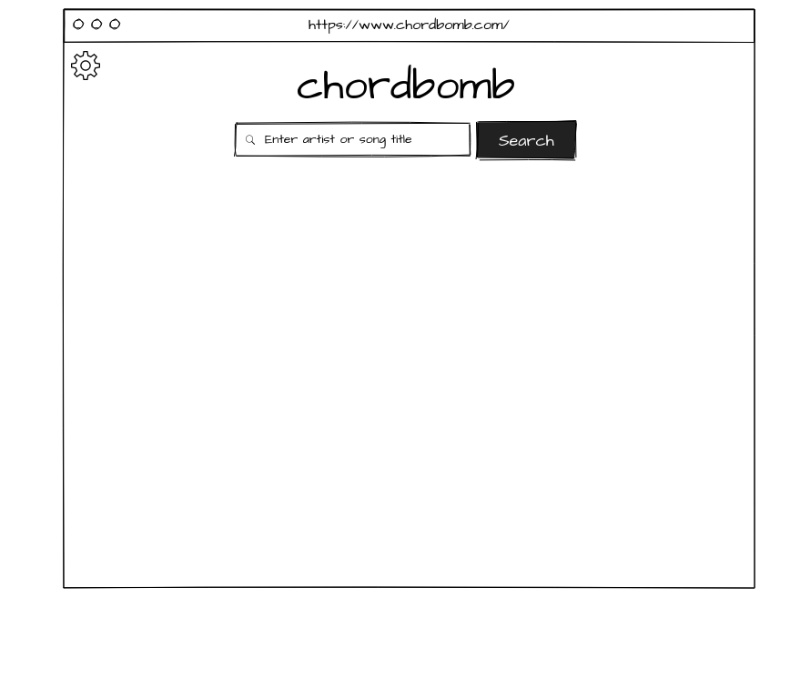
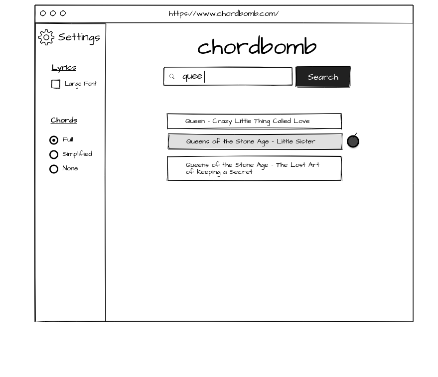
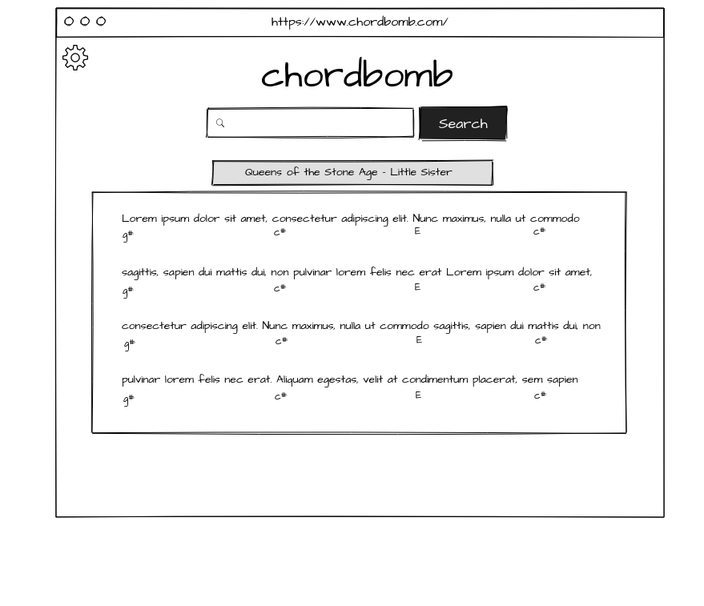

# Chordbomb

Chordbomb is a single-page app built using [Angular CLI](https://github.com/angular/angular-cli) version 11.2.6. It allows users to query a small database of songs, and customize how the lyrics and chords are displayed.

Check it out! Live development server: https://chordbomb.web.app

  
## Version 1.0.0
Currently in development, with `version 1.0.0` set to be deployed by mid-June 2021. Features will include:
* 10 songs stored in Firebase's Firestore Database, able to be retrieved and edited from the app
* Admin login for editing songs in-app
* Search-as-you-type functionality
* Ability to increase text font-size and toggle between 3 different chord modes when viewing song
* Fully responsive design with lazy-loading implemented for increased performance

### Wireframe mock-ups:

