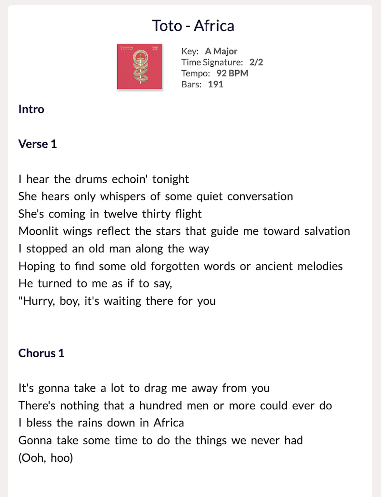

# [Chordbomb](https://www.chordbomb.com)

[www.chordbomb.com](https://www.chordbomb.com)

Chordbomb is a single-page web application, built using [Angular CLI](https://github.com/angular/angular-cli), allowing users to search a small database of songs and customize how the lyrics and chords are displayed.  

## Version 1.0.0
### (released 13.06.2021)
* 10 songs stored in Firebase's Firestore Database
* Songs searchable using Algolia's Instant Search API, which mirrors data through a series of Firebase Cloud Functions; search features include full-text search-as-you-type functionality and typo recognition for 1 every 4 characters
* Admin login for editing songs in-app, with components lazy-loaded for increased app performance
* Settings in sidenav giving user ability to select text font size and chord mode while viewing a song
* Fully-responsive design with a dropdown navigation on smaller viewports

### <b>v. 1.0.1</b> (15.06.2021)
* Site manifest bug fixed
* instantsearch.js reverted to 3.6.0 for better compatibility with other Algolia dependencies
* Ais-Search reverted to automatically displaying all available songs before any query is made or filter added
  

## License
This project is licensed under the [MIT License](LICENSE).
  

## Author
* [Michal Wiraszka](https://github.com/mwiraszka)
  

## Application Screenshots

